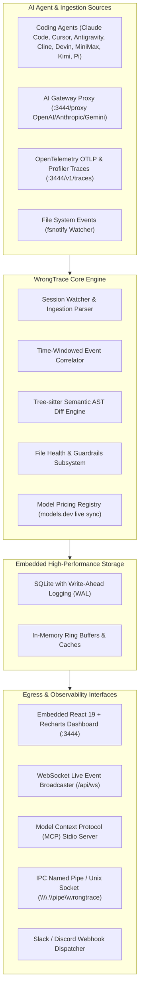

# WrongTrace Architecture & Engineering Deep-Dive

WrongTrace is designed as a **zero-dependency, high-throughput, real-time AI Observability engine** for software codebases monitored during AI agent development.

---

## 1. High-Level System Architecture

---

## 2. Core Subsystems

### A. Semantic AST Diff Engine (`internal/ast/`)
* **Tree-sitter Native Grammar Parsers**: Analyzes code structure in Go, TypeScript, JavaScript, Python, Rust, C/C++, Java, C#, PHP, and Ruby.
* **Symbol Identity**: Generates unique node signatures (e.g., `func:AuthMiddleware`, `method:User.Validate`, `class:OrderService`).
* **Normalized AST Hashing**: Strips non-semantic whitespace and comment volatility to detect true structural mutations.
* **Diff Classification**: Categorizes mutations into `ADDED`, `MODIFIED`, and `DELETED` nodes.

### B. Thrashing & Fragility Detection Algorithm (`internal/core/guardrails.go`)
* **Definition of Thrashing**: When the same AST node is mutated $\ge 3$ times within a sliding 24-hour window.
* **Health Score Formula**:
  $$\text{HealthScore} = \max\left(0, 100 - (\text{RecentThrashCount} \times 15) - (\text{LockPenalty})\right)$$
* **Fragile Threshold**: Any file with a score $< 40$ or active thrashing is marked as `is_fragile = true`, triggering guardrail warnings.

### C. True Token ROI & Code Longevity (`internal/db/queries.go`)
* **Survival Window**: 14-day maturity window.
* **Survival Rate**:
  $$\text{SurvivalRate} = \frac{\text{Nodes Still Intact after 14 Days}}{\text{Total Nodes Introduced by Model}} \times 100\%$$
* **Cost Per Survived Node**:
  $$\text{CostPerSurvivedNode} = \frac{\text{Total Model Dollar Spend}}{\text{Surviving AST Nodes}}$$

### D. Multi-Channel Interceptor Layer
1. **Model Context Protocol (MCP)**: Implements JSON-RPC 2.0 over stdio (`protocolVersion: 2024-11-05`).
2. **IPC Named Pipe**: Windows `\\.\pipe\wrongtrace` and Unix `/tmp/wrongtrace.sock`.
3. **AI Gateway Proxy**: Intercepts streaming SSE chunks, calculates prompt caching discounts, and extracts hidden `<think>` reasoning tokens.
4. **Log Ingestor**: Auto-scans 20+ agent directories continuously.

---

### 4. Transparent AI Gateway Proxy (`internal/proxy/`)
* **Live Ingestion**: Intercepts OpenAI, Anthropic, Gemini, DeepSeek, Groq, Mistral, and custom endpoints.
* **Opt-in Scoped Response Caching (`internal/proxy/cache.go`)**: Requests must send `X-WrongTrace-Cache: allow`. Deterministic SHA-256 keys include a one-way credential/project/agent/session scope so cached completions cannot cross those boundaries.
* **Explicit Policy Mode**: Normal proxying is byte-preserving. `X-WrongTrace-Policy: enforce` enables all mutating/interrupting behavior, including secret redaction, quota blocking, OpenAI usage-option injection, and missing terminal-marker repair.
* **Real-time Secret & Leak Scanner (`internal/proxy/scanner.go`)**: In policy mode, masks AWS keys, GitHub tokens, database connection credentials, and `.env` private keys before outgoing payloads reach cloud LLMs.
* **Token Budget & Quota Guardrail (`internal/proxy/quota.go`)**: In policy mode, enforces daily spending limits per project/agent with `429 Quota Exceeded` protection.
* **Deep Wire Telemetry**: Extracts token usage, thinking blocks (`<think>`), tool calls, and prompt cache hit rates (`cache_read_input_tokens`).

---

## 3. Database Schema (`internal/db/`)

* **`agent_runs`**: Records run metadata, intent, model, provider, tokens, and USD cost.
* **`code_node_events`**: Granular AST diff records tied to file paths, function signatures, and diff text.
* **`runtime_traces`**: OpenTelemetry spans, latency percentiles (P50/P90/P99), error rates, and command traces.
* **`file_locks`**: Active administrative guardrails and lock reasons.
